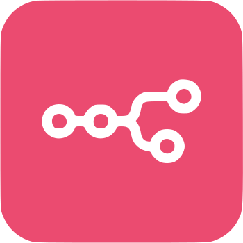

  <strong>JWsley</strong> <<---------------- 
   
  ---------------->>

  

  

   

  

---

<h2 align="center">🧠 Conhecimentos em:</h2>

<table align="center" border="0" cellpadding="10" cellspacing="0" width="100%">
  <tr valign="top">
    <td width="50%">
      <h3 align="center">Fundamentos/Introdutórios</h3>
      <table align="center" border="0" cellpadding="5" cellspacing="5">
        <tr valign="bottom">
          <td align="center" width="60">
            
             
            <strong>HTML5</strong>
          </td>
          <td align="center" width="60">
            
             
            <strong>CSS3</strong>
          </td>
          <td align="center" width="60">
            
             
            <strong>JavaScript</strong>
          </td>
          <td align="center" width="60">
            
             
            <strong>Git</strong>
          </td>
          <td align="center" width="60">
            
             
            <strong>Linux</strong>
          </td>
        </tr>
      </table>
    </td>
    <td width="50%">
      <h3 align="center">Back-end e Frameworks</h3>
      <table align="center" border="0" cellpadding="5" cellspacing="5">
        <tr valign="bottom">
          <td align="center" width="60">
            
             
            <strong>Python</strong>
          </td>
          <td align="center" width="60">
            
             
            <strong>PHP</strong>
          </td>
          <td align="center" width="60">
            
             
            <strong>Django</strong>
          </td>
          <td align="center" width="60">
            
             
            <strong>Flask</strong>
          </td>
          <td align="center" width="60">
            
             
            <strong>CodeIgniter</strong>
          </td>
          <td align="center" width="60">
            
             
            <strong>Bash</strong>
          </td>
          <td align="center" width="60">
            
             
            <strong>Bootstrap</strong>
          </td>
        </tr>
      </table>
    </td>
  </tr>
  <tr valign="top">
    <td width="50%">
      <h3 align="center">Bancos de Dados</h3>
      <table align="center" border="0" cellpadding="5" cellspacing="5">
        <tr valign="bottom">
          <td align="center" width="60">
            
             
            <strong>MySQL</strong>
          </td>
          <td align="center" width="60">
            
             
            <strong>PostgreSQL</strong>
          </td>
          <td align="center" width="60">
            
             
            <strong>MariaDB</strong>
          </td>
        </tr>
      </table>
    </td>
    <td width="50%">
      <h3 align="center">Data & IA</h3>
      <table align="center" border="0" cellpadding="5" cellspacing="5">
        <tr valign="bottom">
          <td align="center" width="60">
            
             
            <strong>Pandas</strong>
          </td>
          <td align="center" width="60">
            
             
            <strong>OpenCV</strong>
          </td>
          <td align="center" width="60">
            
             
            <strong>PyTorch</strong>
          </td>
          <td align="center" width="60">
            
             
            <strong>n8n</strong>
          </td>
        </tr>
      </table>
    </td>
  </tr>
  <tr valign="top">
    <td colspan="2">
      <h3 align="center">Ferramentas</h3>
      <table align="center" border="0" cellpadding="5" cellspacing="5">
        <tr valign="bottom">
          <td align="center" width="60">
            
             
            <strong>Docker</strong>
          </td>
          <td align="center" width="60">
            
             
            <strong>Selenium</strong>
          </td>
          <td align="center" width="60">
            
             
            <strong>Figma</strong>
          </td>
          <td align="center" width="60">
            
             
            <strong>Obsidian</strong>
          </td>
        </tr>
      </table>
    </td>
  </tr>
</table>
  

  

---

