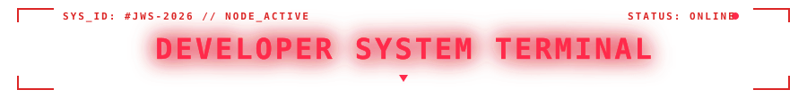

  

  

  

  

  

<table align="center" border="0" cellpadding="10" cellspacing="0" width="100%">
  <tr valign="top">
    <td width="50%">
      <h3 align="center" style="color: #ff2a4b;">◈ Fundamentos/Introdutórios</h3>
      <table align="center" border="0" cellpadding="5" cellspacing="5">
        <tr valign="bottom">
          <td align="center" width="60">
            
             
            <strong style="color: #FFFFFF;">HTML5</strong>
          </td>
          <td align="center" width="60">
            
             
            <strong style="color: #FFFFFF;">CSS3</strong>
          </td>
          <td align="center" width="60">
            
             
            <strong style="color: #FFFFFF;">JS</strong>
          </td>
          <td align="center" width="60">
            
             
            <strong style="color: #FFFFFF;">Git</strong>
          </td>
          <td align="center" width="60">
            
             
            <strong style="color: #FFFFFF;">Linux</strong>
          </td>
        </tr>
      </table>
    </td>
    <td width="50%">
      <h3 align="center" style="color: #ff2a4b;">◈ Back-end e Frameworks</h3>
      <table align="center" border="0" cellpadding="5" cellspacing="5">
        <tr valign="bottom">
          <td align="center" width="60">
            
             
            <strong style="color: #FFFFFF;">Python</strong>
          </td>
          <td align="center" width="60">
            
             
            <strong style="color: #FFFFFF;">Flask</strong>
          </td>
          <td align="center" width="60">
            
             
            <strong style="color: #FFFFFF;">PHP</strong>
          </td>
          <td align="center" width="60">
            
             
            <strong style="color: #FFFFFF;">CodeIgniter</strong>
          </td>
          <td align="center" width="60">
            
             
            <strong style="color: #FFFFFF;">Bash</strong>
          </td>
          <td align="center" width="60">
            
             
            <strong style="color: #FFFFFF;">Next.js</strong>
          </td>
          <td align="center" width="60">
            
             
            <strong style="color: #FFFFFF;">Ionic</strong>
          </td>
        </tr>
      </table>
    </td>
  </tr>
  <tr valign="top">
    <td width="50%">
      <h3 align="center" style="color: #ff2a4b;">◈ Bancos de Dados</h3>
      <table align="center" border="0" cellpadding="5" cellspacing="5">
        <tr valign="bottom">
          <td align="center" width="60">
            
             
            <strong style="color: #FFFFFF;">MySQL</strong>
          </td>
          <td align="center" width="60">
            
             
            <strong style="color: #FFFFFF;">Postgres</strong>
          </td>
          <td align="center" width="60">
            
             
            <strong style="color: #FFFFFF;">MariaDB</strong>
          </td>
        </tr>
      </table>
    </td>
    <td width="50%">
      <h3 align="center" style="color: #ff2a4b;">◈ Data & IA</h3>
      <table align="center" border="0" cellpadding="5" cellspacing="5">
        <tr valign="bottom">
          <td align="center" width="60">
            
             
            <strong style="color: #FFFFFF;">Pandas</strong>
          </td>
          <td align="center" width="60">
            
             
            <strong style="color: #FFFFFF;">OpenCV</strong>
          </td>
          <td align="center" width="60">
            
             
            <strong style="color: #FFFFFF;">n8n</strong>
          </td>
          <td align="center" width="60">
            
             
            <strong style="color: #FFFFFF;">LM Studio</strong>
          </td>
        </tr>
      </table>
    </td>
  </tr>
  <tr valign="top">
    <td width="50%">
      <h3 align="center" style="color: #ff2a4b;">◈ Ferramentas</h3>
      <table align="center" border="0" cellpadding="5" cellspacing="5">
        <tr valign="bottom">
          <td align="center" width="60">
            
             
            <strong style="color: #FFFFFF;">Docker</strong>
          </td>
          <td align="center" width="60">
            
             
            <strong style="color: #FFFFFF;">Selenium</strong>
          </td>
          <td align="center" width="60">
            
             
            <strong style="color: #FFFFFF;">Obsidian</strong>
          </td>
          <td align="center" width="60">
            
             
            <strong style="color: #FFFFFF;">Notion</strong>
          </td>
          <td align="center" width="60">
            
             
            <strong style="color: #FFFFFF;">Warp</strong>
          </td>
        </tr>
      </table>
    </td>
    <td width="50%">
      <h3 align="center" style="color: #ff2a4b;">◈ Sistemas Operacionais</h3>
      <table align="center" border="0" cellpadding="5" cellspacing="5">
        <tr valign="bottom">
          <td align="center" width="60">
            
             
            <strong style="color: #FFFFFF;">Windows</strong>
          </td>
          <td align="center" width="60">
            
             
            <strong style="color: #FFFFFF;">Debian</strong>
          </td>
          <td align="center" width="100" style="border: 1px solid #ff2a4b; border-radius: 10px; background: rgba(255, 42, 75, 0.15);">
            
             
            <strong style="color: #FFFFFF;">Arch/Hypr</strong>
          </td>
        </tr>
      </table>
    </td>
  </tr>
</table>

  

  

 

  

 

  

  

  

